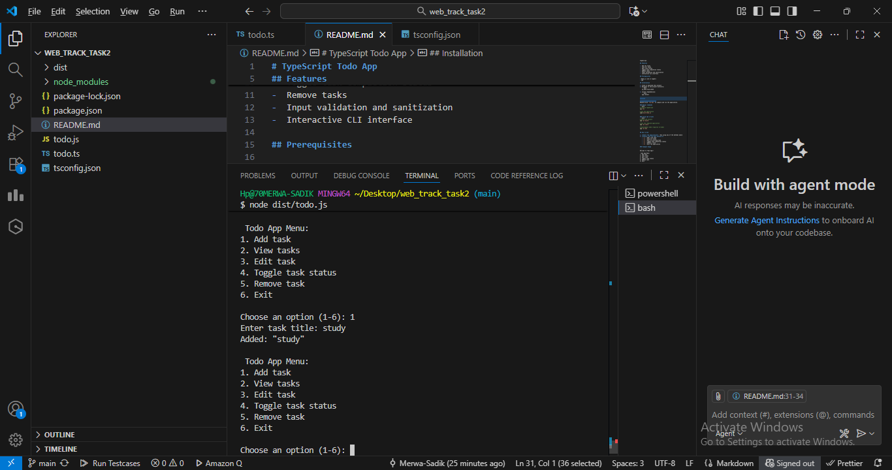
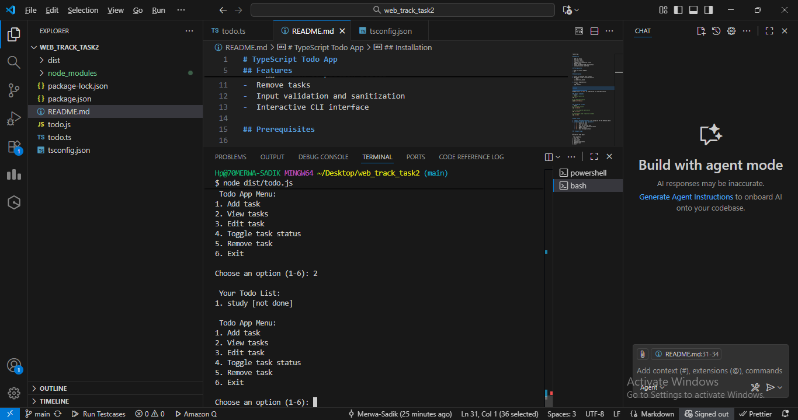
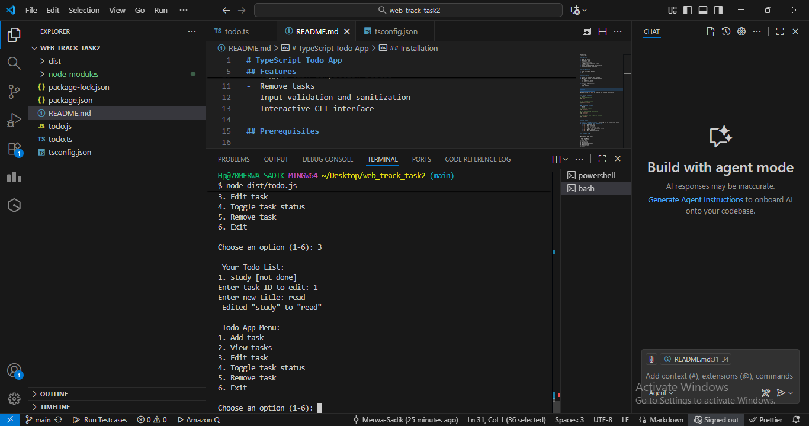
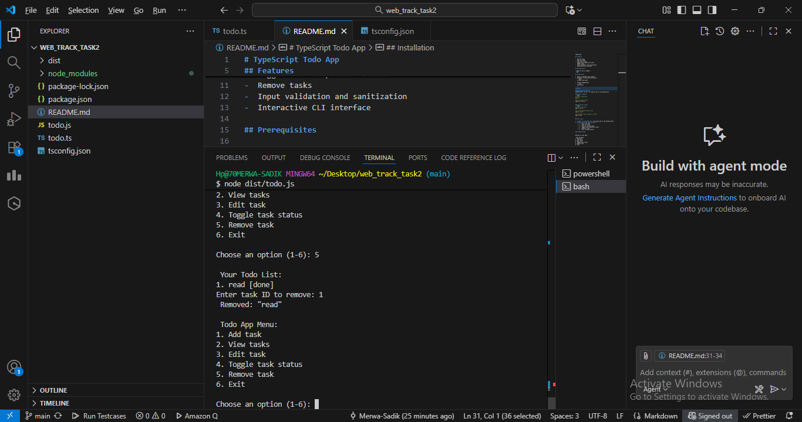
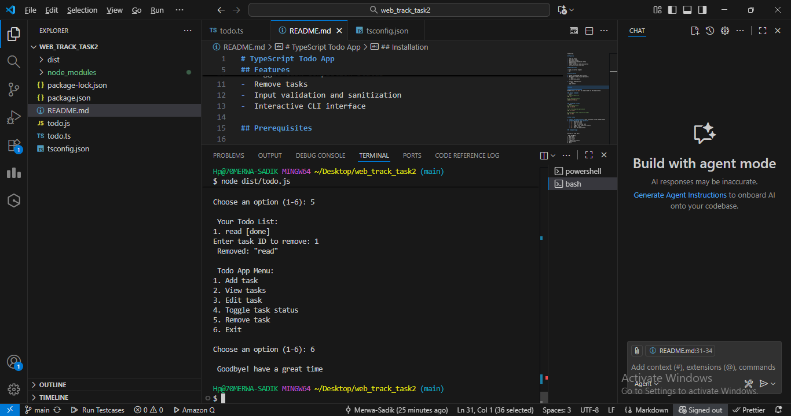
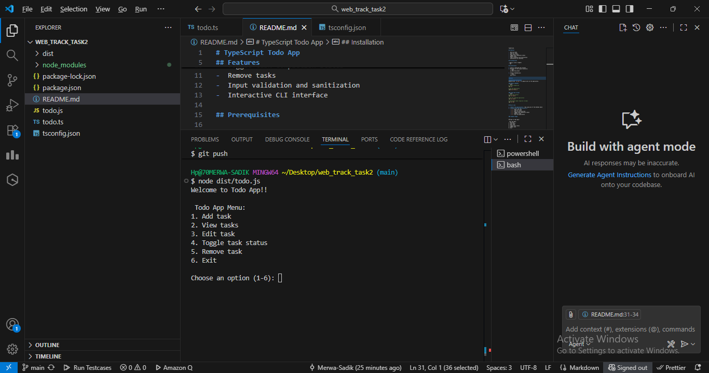

# TypeScript Todo App

A simple, interactive command-line todo application built with TypeScript.

## Features

-  Add new tasks
-  View all tasks
-  Edit task titles
-  Toggle task completion status
-  Remove tasks
-  Input validation and sanitization
-  Interactive CLI interface

## Prerequisites

- Node.js (v14 or higher)
- npm

## Installation

1. Clone or download this project
2. Navigate to the project directory:
   ```bash
   cd web_track_task2
   ```
3. Install dependencies:
   ```bash
   npm install
   ```

## Usage

### Quick Start (Windows)
Double-click `run.bat` to compile and run the application.

### Manual Commands
```bash
# Compile TypeScript
npx tsc

# Run the application
node dist/todo.js
```

### Using npm scripts
```bash
# Build the project
npm run build

# Run the compiled application
npm run start

# Development mode (requires ts-node)
npm run dev
```

## How to Use

1. **Start the application** - Run using any of the methods above
2. **Choose from the menu options:**
   - `1` - Add a new task
   - `2` - View all tasks
   - `3` - Edit an existing task
   - `4` - Toggle task completion status
   - `5` - Remove a task
   - `6` - Exit the application

### Example Usage

```
Welcome to Todo App!!

 Todo App Menu:
1. Add task
2. View tasks
3. Edit task
4. Toggle task status
5. Remove task
6. Exit

Choose an option (1-6): 1
Enter task title: Buy groceries
Added: "Buy groceries"

Choose an option (1-6): 2

 Your Todo List:
1. Buy groceries [not done]
```
### for instance: screenshots









## Project Structure

```
web_track_task2/
├── todo.ts          # Main TypeScript source file
├── tsconfig.json    # TypeScript configuration
├── package.json     # Node.js dependencies and scripts
├── dist/           # Compiled JavaScript output
└── README.md       # This file
```

## Technical Details

- **Language:** TypeScript
- **Runtime:** Node.js
- **Architecture:** Object-oriented with TodoManager class
- **Security:** Input sanitization to prevent log injection
- **Error Handling:** Comprehensive validation for user inputs

## Security Features

- Input sanitization for logging
- Validation for empty titles
- ID validation for numeric inputs
- Protection against log injection attacks

## Development

To modify the application:

1. Edit `todo.ts`
2. Compile with `npx tsc`
3. Test with `node dist/todo.js`

## Troubleshooting

### PowerShell Execution Policy Error
If you encounter execution policy errors on Windows:
- Use Command Prompt instead of PowerShell
- Or run: `Set-ExecutionPolicy -ExecutionPolicy RemoteSigned -Scope CurrentUser`

### TypeScript Compilation Errors
Ensure all dependencies are installed:
```bash
npm install
```
